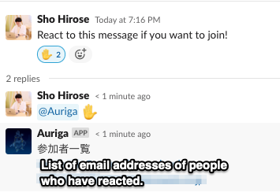

# Auriga - Slackbot to make your scheduling smoothly

[English](README.md) | [日本語](README_jp.md)


Auriga is a Slackbot that creates Google Calendar appointments and automatically invites people who react in Slack.

In the northern sky, there is the constellation Auriga.
Auriga moves the carriage and leads all participants to their destination.
The functionality we wanted to achieve with Slackbot and the mission of Auriga coincided, hence the product name "Auriga".

## TODOs

- [ ] Integrate with Google Calendar

## Usage

[](https://heroku.com/deploy)



1. Call Auriga in a thread like `@Auriga :reaction:` and specify the reaction.
2. Auriga returns a list of email addresses of users who had the specified reaction (`:reaction:`) to the thread's parent message.
3. Paste the results into Google Calendar and invite them into your schedule in bulk!

## Development Environment
- Golang 1.17.7

### Requirements

- goenv
- Docker and docker-compose

#### environment variables

The following variables are required to run the Auriga.

```env
SLACK_APP_TOKEN=<Slack App Token>
SLACK_BOT_TOKEN=<Slack App Token>
```

You can set these as system environment variables or place a `.env` file in the project root.

## install tools, run, lint

```shell
make install # install go, and tools
make run # run
make lint #lint
```

## Licenses

Auriga is licensed under the Apache License, Version 2.0. See [LICENSE](./LICENSE) for the full license text.
