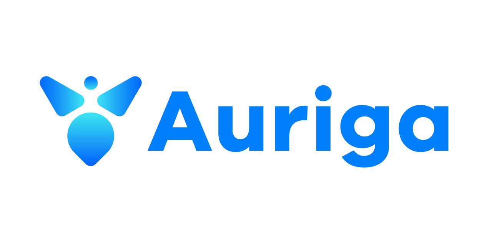
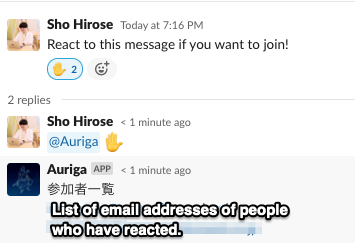

# Auriga



aurigaは Slackでリアクションした人を自動で招待し、Googleカレンダーの予定を作るbotです。

auriga は馭者座という北天の星座を意味しています。
馬車を動かし、参加者全員を目的地に導く馭者のように動いてほしいという気持ちからこの名前がつけられています。

## これからやりたいこと

[English](README.md) | [日本語](README_jp.md)

- [ ] Google Calendar との連携

## 使い方



1. スレッドで `@Auriga :sanka:` のようにAurigaを呼び出し、リアクションを指定してください。
2. スレッドの開始メッセージに指定のリアクションをしたユーザのメールアドレス一覧を返します。
3. 結果をGoogleCalenderに貼り付けると一括招待できます！

## 開発環境

Golang 1.17.7

### 必要な環境

- goenv
- Docker / docker-compose

#### 環境変数について

アプリケーションの実行には、以下の環境変数が必要です。

```env
SLACK_APP_TOKEN=<Slack App Token>
SLACK_BOT_TOKEN=<Slack App Token>
```

環境変数として設定するか、`.env`ファイルをプロジェクトルートに配置してください。

## install, run, lint

```shell
make install # install
make run # run
make lint #lint
```
## Licences

Auriga は Apache License, Version 2.0 に基づいて利用できます。ライセンスの全文は [LICENSE](./LICENSE) を参照してください。